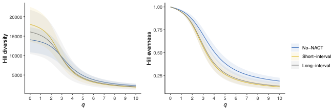

Github repository for the paper "T cell receptor repertoire sequencing reveals chemotherapy-driven clonal expansion in colorectal liver metastases" by Høye et al.

Adaptive ImmunoSEQ rearrangement files can be downloaded from:  
clients.adaptivebiotech.com  
email: hoye-review@adaptivebiotech.com  
password: hoye2022review

As well as from:

https://drive.google.com/drive/folders/1K0XESt0sMMNieD-YYv9GmFOOPs2PtHqB?usp=sharing


Overview of files required for the R_markdown analysis.
```
data/
- SampleOverview_10-11-2021_1-47-39_PM.tsv: Sequencing parameters for all samples, including sequencing bathc 376276 and 12511620, downloaded from the immunoSEQ ANALYZER SampleOverview page. Loaded on line 57 in the markdown
- qcReport_kit_1.tsv: QC report from sequencing batch 376276, downloaded from immunoSEQ ANALYZER v2, samples with sequencing coverage < 5 where excluded from clonality analysis. Loaded on line 227 in the markdown
- qcReport_kit_2.tsv: QC report from sequencing batch 12511620, downloaded from immunoSEQ ANALYZER v2, samples with sequencing coverage < 5 where excluded from clonality analysis. Loaded on line 228 in the markdown
- metadata_all_v2.txt: metadata including COMET_ID and NACT group for all datasets. Loaded on line 60 of the markdown

hill_div/ 
- directory contains tsv files output from the Hill_Diversity_v2.R script

envs/
- contain yaml files for conda virtual environments needed to run scripts. Also needed for snakemake rules.

scripts/
- contain the scripts neccessary for some precursor steps in the analysis. 
- Hill_Diversity.R is used to make Hill diversity and evenness profiles. Script part of snakemake rule.
- concat_Hill.R, cleans up diversity and evenness output into tidy dataframe.

```

To generate hill diversity profiles, edit the config.yaml file to contain the appropriate paths.

Because generating diversity profiles can be annoying, it is a good idea to run them through the snakemake workflow script, so each sample only has to be run once, regardless of whether additional samples are added to the analysis.

First, ensure that the rearrangement files are organized as one file per sample in the data/rearrangements directory. If you have all rearrangements merged into a single file, you can unmerge them in the same directory using: 
```
python scripts/Rearrangement_to_single_files.py </path/to/rearrangements_dir/> <rearrangements_filename.tsv>
```

To run the snakemake script, first install and activate a conda environment containing snakemake library, then use the following command:
```
# Install snakemake, follow:
# https://snakemake.readthedocs.io/en/stable/getting_started/installation.html

conda activate base
mamba create -c conda-forge -c bioconda -n snakemake snakemake
conda activate snakemake

# Then, in the same directory as the SnakeMake file, run:
snakemake -j<number of cores> --configfile <path to config.yaml> --use-conda

# Note, it is important that the .yaml files are present in the envs/ directory, so that the neccessary conda environments are present.

# This will run the snakemake rules to generate diversity and evenness profiles in the results/<project_name> folder, and also concatenate them into a single tidy dataframe, as well as a dataframe with auc derived clonality values for each sample, which are easy to work with.

```

The hill_all.tsv can be loaded in R, and ggplot2 can easily produce publication quality figures with the following code:

```
library(tidyverse)
# Load metadata with NACT interval
metadata <- readxl::read_excel("/path/to/metadata.xlsx")

# Set path to directory of hill diversity profiles
path <- '/path/to/hill_div/'
list_of_files <- list.files(path = path,
                            recursive = TRUE,
                            pattern = "\\.tsv$",
                            full.names = TRUE)

# create dataframe and merge with metadata, then exclude samples with coverage < 5
df <- readr::read_tsv(list_of_files)
df <- df %>% left_join(metadata[, c("Sample", "COMET_ID")], by=c("sample_id"="Sample")) %>%
  left_join(coverage) %>% filter(Coverage >= 5)

# calculate confidence intervalls:
get_CI_half_width <- function(x, prob) {
  n <- length(x)
  z_t <- qt(1 - (1 - prob) / 2, df = n - 1)
  z_t * sd(x) / sqrt(n)
}

lower <- function(x, prob = 0.95) {
  mean(x) - get_CI_half_width(x, prob)
}

upper <- function(x, prob = 0.95) {
  mean(x) + get_CI_half_width(x, prob)
}

no_chemo_ <- df %>% 
  merge(metadata, by.x = 'COMET_ID', by.y = 'COMET_ID') %>% 
  as_tibble() %>% filter(group == 'no_chemo') %>%
  group_by(q) %>% summarize_at(vars(c('d','e')), funs(mean, sd, min, max, lower, upper)) %>%
  mutate(group='no_chemo')

short_chemo_ <- df %>% 
  merge(metadata, by.x = 'COMET_ID', by.y = 'COMET_ID') %>% 
  as_tibble() %>% filter(group == 'short_chemo') %>%
  group_by(q) %>% summarize_at(vars(c('d','e')), funs(mean, sd, min, max, lower, upper)) %>%
  mutate(group='short_chemo')

long_chemo_ <- df %>% 
  merge(metadata, by.x = 'COMET_ID', by.y = 'COMET_ID') %>% 
  as_tibble() %>% filter(group == 'long_chemo') %>%
  group_by(q) %>% summarize_at(vars(c('d','e')), funs(mean, sd, min, max, lower, upper)) %>%
  mutate(group='long_chemo')

df_hill <- bind_rows(bind_rows(no_chemo_, short_chemo_), long_chemo_) %>%
  mutate(group = factor(group, levels=c("no_chemo", "short_chemo", "long_chemo")))
  
# Use ggplot2 to plot hill diversity
p1 <- df_hill %>%
  mutate(`NACT-group` = case_when(
    group == 'no_chemo' ~ 'No-NACT',
    group == 'short_chemo' ~ 'Short-interval',
    group == 'long_chemo' ~ 'Long-interval'
  )) %>%
  mutate(`NACT-group` = factor(`NACT-group`, levels = c('No-NACT', 'Short-interval', 'Long-interval'))) %>%
  ggplot(aes(x=q, y=d_mean, group=`NACT-group`, color=`NACT-group`)) +
  geom_line() +
  geom_ribbon(aes(ymin = d_lower, ymax = d_upper, fill=`NACT-group`), alpha = 0.1, color=NA) +
  theme_classic() +
  xlab("q") + ylab('Hill diversity') + 
  theme(axis.title.x = element_text(face='italic')) +
  scale_x_continuous(breaks=c(0, 1, 2, 3, 4, 5, 6, 7, 8, 9, 10)) + theme(legend.title = element_blank())
p1 <- set_palette(p1, 'jco')  

# Use ggplot2 to plot hill evenness
p2 <- df_hill %>%
  ggplot(aes(x=q, y=e_mean, group=group, color=group)) +
  geom_line() +
  geom_ribbon(aes(ymin = e_lower, ymax = e_upper, fill=group), alpha = 0.1, color=NA) +
  theme_classic() +
  xlab("q") + ylab('Hill evenness') + 
  theme(axis.title.x = element_text(face='italic')) +
  scale_x_continuous(breaks=c(0, 1, 2, 3, 4, 5, 6, 7, 8, 9, 10))
p2 <- set_palette(p2, 'jco')  

# merge to one plot with the same legend, then save 
leg <- get_legend(p1)
p3 <- ggarrange(p1, p2, ncol=2, nrow=1,
          legend.grob = leg, 
          legend='right')
ggsave(filename = '/path/to/hill_div_even.pdf',
       plot = p3, width = 9, height=3)
```

 


To set up imnet for network analysis, do:
```
# First create venv with 
virtualenv -p /usr/bin/python3.6 venv
source venv/bin/activate
pip install imnet pyspark
pip install findspark
pip install imnet

# must edit venv/lib/python3.6/site-packages/imnet/process_strings.py
# replace all instances of  idxs = range(nstrings)  to idxs = list(range(nstrings))

# First activate venv and make sure pyspark environment is set:
source venv/bin/activate
export PYSPARK_PYTHON=/home/jcdenton/imnet/venv/bin/python3.6
export PYSPARK_DRIVER_PYTHON=/home/jcdenton/imnet/venv/bin/python3.6

# run the test
pyhton test_imnet.py
```
