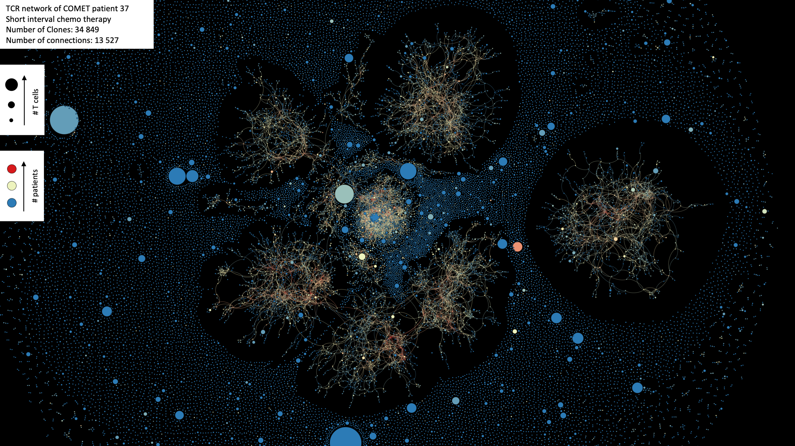

Github repository for the paper "T cell receptor repertoire sequencing reveals chemotherapy-driven clonal expansion in colorectal liver metastases" by Høye et al.

Adaptive ImmunoSEQ rearrangement files can be downloaded from:  
clients.adaptivebiotech.com  
email: hoye-review@adaptivebiotech.com  
password: hoye2022review

As well as from:

https://drive.google.com/drive/folders/1K0XESt0sMMNieD-YYv9GmFOOPs2PtHqB?usp=sharing


Overview of files required for the R_markdown analysis.
```
data/
- rearrangements/     Directory with adaptive ImmunoSEQ rearrangement .tsv files for each sample.
- SampleOverview.tsv  Contains sequencing metadata for each sample, and the amount of input gDNA.
- metadata.xlsx       Clinical metadata relevant for the analysis. Also specifies which patient was sampled multiple times.
- qcReport.tsv        Quality control report for each sample, including coverage. Coverage is average number of reads per rearranged DNA template. Samples with coverage < 5 were discarded from clonality analysis.
- graph_params/       Directory with data related to graph parameters and analysis
- graphs/             Directory with graphs generated with scripts/run_imnet.py
- McPAS/              Directory containing the search results in McPAS, a repository of TCR sequences with known pathogen associations. 

hill_div/ 
- directory contains tsv files output from the Hill_Diversity_v2.R script

envs/
- contain yaml files for conda virtual environments needed to run scripts. Also needed for snakemake rules.

scripts/
- Hill_Diversity_v2.R           R script for generating Hill Diversity and evenness profiles. Run with snakemake.
- concat_Hill.R                 Concatenate diversity and evenness output into tidy dataframe. Run with snakemake.
- run_imnet.py                  Create graphs from ImmunoSEQ rearrangement files in data/rearrangements.
- powerlaw.R                    Script for calculating powerlaw fit from clonal degree distribution.
- global_params.py              Calculate global graph parameters from .graphml file.
- local_params.py               Calculate local graph parameters from .graphml file.
- Rearrangement_to_single_files.py  Split ImmunoSEQ rearrangement dataframe into individual files for each sequencing sample.
- Some additional deprecated scripts kept for future reference, but not used in the analysis.

R_markdowns/
- Contains R markdowns used to generate figures used in the paper. Note this was the actual file used, 
  some filepaths will have to be changed to your local directory structure.

```
Because generating diversity profiles can be time consuming, it is a good idea to run them through a snakemake workflow script, so each sample only has to be run once, regardless of whether additional samples are added to the analysis.

To generate hill diversity profiles, edit the config.yaml file to contain the appropriate paths.

First, ensure that the rearrangement files are organized as one file per sample in the data/rearrangements directory. If you have all rearrangements merged into a single file, you can unmerge them in the same directory using: 
```
python scripts/Rearrangement_to_single_files.py </path/to/rearrangements_dir/> <rearrangements_filename.tsv>
```
To run the snakemake script, first install and activate a conda environment containing snakemake library, then use the following command:
```
# Install snakemake, follow:
# https://snakemake.readthedocs.io/en/stable/getting_started/installation.html

conda activate base
mamba create -c conda-forge -c bioconda -n snakemake snakemake
conda activate snakemake

# Then, in the same directory as the SnakeMake file, run:
snakemake -j<number of cores> --configfile <path to config.yaml> --use-conda

# Note, it is important that the .yaml files are present in the envs/ directory, so that the neccessary conda environments are present.

# This will run the snakemake rules to generate diversity and evenness profiles in the results/<project_name> folder, and also concatenate them into a single tidy dataframe, as well as a dataframe with auc derived clonality values for each sample, which are easy to work with.
```
To produce publication quality figures, use:
```
Rscript scripts/plot_hill.R
```
 

These plots provide a detailed view of the clonal frequency distribution of a T cell receptor repertoire. At low values of q (x-axis), the diversity curve is mainly influenced the absolute number of unique clones, while at higher values, diversity is primarily influenced by the most prevalent clones. Another way to interpret the curves is that, while the left part reflects the absolute number of unique clones, the further and more rapidly the curve drops at increasing values of q, the more skewed the clonal frequency distripution is in favour of a small number of very abundant clones. The evenness profile on the right is normalized by the total number of clones.
For generating levenshtein distance based graphs from the clonal sequences in a repertoire, it is best to use imnet, which paralelizes the job. The memory required to create sequential levenshtein distance matrixes scales exponentially, therefore analyzing networks from greater than 10000 sequences can be difficult without paralellization. 

To set up imnet for network analysis, do:
```
# First create venv with 
virtualenv -p /usr/bin/python3.6 venv
source venv/bin/activate
pip install imnet pyspark
pip install findspark
pip install imnet

# must edit venv/lib/python3.6/site-packages/imnet/process_strings.py
# replace all instances of  idxs = range(nstrings)  to idxs = list(range(nstrings))

# First activate venv and make sure pyspark environment is set:
source venv/bin/activate
export PYSPARK_PYTHON=/home/jcdenton/imnet/venv/bin/python3.6
export PYSPARK_DRIVER_PYTHON=/home/jcdenton/imnet/venv/bin/python3.6

# To create clonal sequence based graphs, use:
pyhton scripts/run_imnet.py <path/to/rearrangement.tsv> <name_outfile>
```

This outputs graphs in the .graphml format. Graph visualization software such as gephi can be used to generate high quality visualizations of these networks:

 
